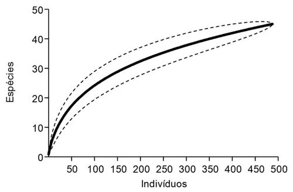

## Curva de Rarefação de Espécies

A curva de rarefação é uma ferramenta estatística usada em ecologia para comparar a riqueza de espécies entre diferentes comunidades quando o esforço amostral (número de indivíduos coletados ou amostras realizadas) não é o mesmo. A análise calcula quantas espécies ocorrem (em média) em números crescentes de parcelas e constroi uma curva.

{fig-align="center" width="300"}

***Carregar os dados*** (se ainda não estão carregados)

```{r eval=FALSE}
library(readxl)
library(writexl)
setwd("C:/Inventario") 
dados <- read_excel("Restinga.xlsx")

```

***Carregar pacotes necessários para esta análise*** (se ainda não estão carregados)

```{r eval=FALSE}
library(vegan)

```

***Cácular a Curva***

```{r eval=FALSE}
matriz_freq <- xtabs(~Parcela+Especie, dados)
curva_acum <- specaccum(matriz_freq)

# Plotar a curva

plot(curva_acum, 
     ci.type="polygon",
     ci.col="lightskyblue1",
     ci.lty = 0,
     lwd=1,
     lty=2,
     xlab="Unidades amostrais",
     ylab="Riqueza",
     main="Curva de acumulação de espécies")
grid(col = "lightgray", lty = 3)

```

------------------------------------------------------------------------

***Para mudar a cor***

Para mudar a cor do gráfico é só trocar "lightskyblue1", e plotar novamente

As cores básicas em inglês ([**green**]{style="color: GREEN;"}, [**blue**]{style="color: BLUE;"}, [**red**]{style="color: RED;"}, [**orange**]{style="color: ORANGE;"},[**yellow**]{style="color: YELLOW;"}, [**magenta**]{style="color: MAGENTA;"}) funcionam, mas tem uma infinidade de opções

Vejam os códigos de cores no [ColorChart.pdf](files\ColorChart.pdf){target="_blank" rel="noopener noreferrer"}

***Outras Alterações no gráfico***

-   Excluir a grade de fundo basta rodar sem a última linha ("grid(col=...")

-   Para circundar a curva com uma linha, troquem o 0 por 1 em "ci.lty = 0"

-   A linha "lwd=1" controla a espessura do contorno

-   A linha "lty=2" controla o pontinhado da linha central

***Suficiência Amostral***

A representatividade da amostragem é considerada adequada quando a curva atingir estabilização (parar de mudar significativamente o ângulo) ou quando a riqueza observada alcançar pelo menos 85% da riqueza estimada.
