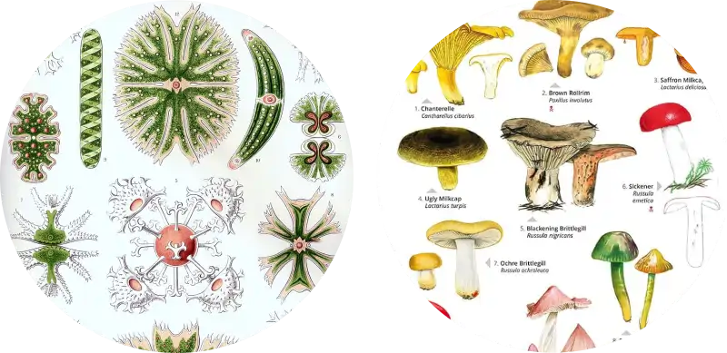

## Biodiversidade de Algas e Fungos

É uma disciplina teórico-prática do 2º período do Curso de Ciências Biológicas. Nela os estudantes integram conhecimentos referentes aos ramos evolutivos que abrigam Algas ou Fungos. Ao final, são capazes de reconhecer os táxons envolvidos, suas relações evolutivas, interações ambientais e importância econômico-social.

{fig-align="center" width="400"}

### Atividades - Trabalhos

Ao longo do sementre vocês vão realizar três trabalhos sendo um projetos de pesquisa nos moldes de atividades desenvolvidas profissionalmente por biólogos em campo. Uma sobre ***Monitoramento de Reservatórios*** que envolve atividades análise de água de um lago de Curitiba, um trabalho sobre ***Produtos Extraídos ed Algas Marinha***, que envolve a indetificaçã de embalagens de produtos que contenham algas e um terceiro, um ***seminário sobre fungos***.

{fig-align="center" width="800"}

[**1 - Monitoramento de Reservatórios**](algas1.qmd)

[**2 - Produtos Extraídos de Algas Marinha**](algas2.qmd)

[**3 - Seminário sobre fungos**](algas3.qmd)

