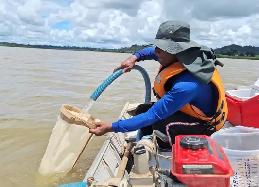

## Monitoramento de Reservatório - Fitoplancton

O monitoramento de reservatório é uma atividade sistema que procura variáveis importantes do reservatório — como vazão, qualidade da água (pH, temperatura, turbidez) e padrões de consumo — com o objetivo de garantir o abastecimento seguro, prevenir falhas, economizar recursos e otimizar a gestão hídrica.

O fitoplâncton é amplamente utilizado como bioindicador da qualidade da água em reservatórios, especialmente para monitorar processos de eutrofização e impactos ambientais. A comunidade fitoplanctônica responde rapidamente a mudanças nos parâmetros físicos, químicos e biológicos, permitindo a detecção precoce de degradação hídrica servindo como excelentes indicadores biológicos.

{fig-align="center" width="350"}

{fig-align="center" width="600"}

***Trabalho em duplas***

Esta atividade será realizada duarante as aulas práticas

Vocês irão simular uma atividade de monitoramento ambiental de Fitoplâncton em um reservatório de captação de água da SANEPAR seguindo as diretrizes nacionais para o monitoramento de Fitoplancton

<https://www.gov.br/transportes/pt-br/assuntos/sustentabilidade>{target="_blank" rel="noopener noreferrer"}

Segue o modelo de relatório para as Algas (Fitoplancton)

[Modelo_Algas](files\modelo_algas.docx){target="_blank" rel="noopener noreferrer"}
