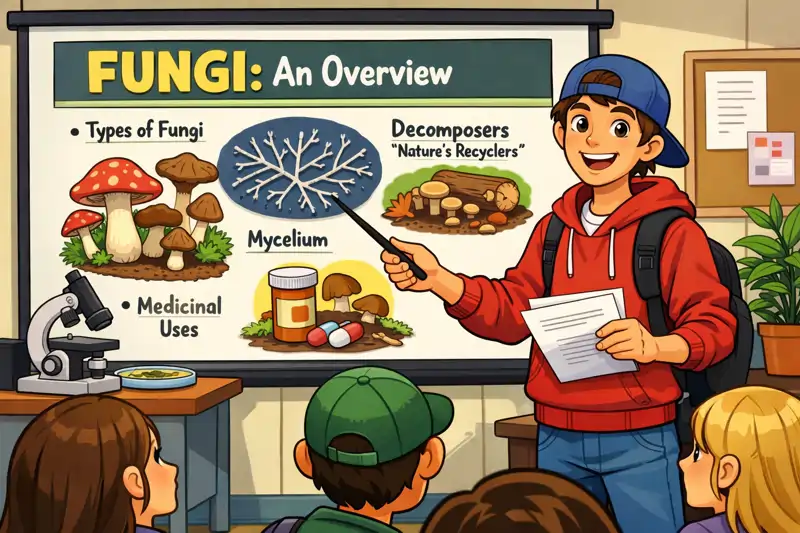
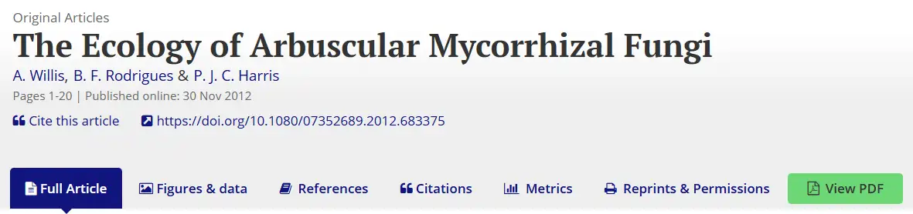

## Seminário sobre Fungos

***Artigos Científicos*** são a base da ciência e essenciais para o desenvolvimento e divulgação científica. Em um artigo são apresentados os métodos e resultados de uma pesquisa. É essencial que um biólogo seja capaz de ler e interpretar textos técnicos técnicos.

Aprender a apresentar ***seminários*** é essencial para o biólogo pois desenvolve habilidades críticas e práticas fundamentais para o sucesso acadêmico e profissional. O seminário é um processo de aprendizagem ativa, que exige pesquisa, organização de ideias, domínio do conteúdo e capacidade de comunicação clara e persuasiva. Ao apresentar, você não apenas demonstra conhecimento, mas também aprende a estruturar argumentos, lidar com dúvidas e interagir com o público de forma eficaz.

Além disso: os Fungos desempenham papéis fundamentais nos ecossistemas por meio de diversas interações ecológicas, essenciais para o equilíbrio e a sustentabilidade da vida na Terra, mas isso vocês já sabem

{fig-align="center" width="350"}

{fig-align="center" width="600"}

***Trabalho em equipes de 3-4 integrantes***

(equipes maiores terão a nota proporcionalmente reduzida)

As equipes vão apresentar na forma de seminário um ***artigo de pesquisa*** publicado em uma ***revista científica*** sobre Interações Ecológicas de Fungos.

NÃO VALEM ARTIGOS DE DIVULGAÇÃO (SUPERINTERESSANTE, CIENCIA HOJE, GALILEU, SCIENTIFIC AMERICAN, etc.)

O artigo ***TEM QUE TER***

::: callout
-   Introdução

-   Objetivos

-   Materiais e Métodos

-   Resultados

-   Discussão

-   Conclusão

-   Bibliografia
:::

***Parte 1: encontrar o artigo***

Procurem em bases de dados científicas tais como:

::: callout
-   [Google acadêmico](https://scholar.google.com.br){target="_blank" rel="noopener noreferrer"}

-   [Scielo](https://www.scielo.br){target="_blank" rel="noopener noreferrer"}

-   [Portal de Periódicos CAPES](https://www.periodicos.capes.gov.br){target="_blank" rel="noopener noreferrer"}

-   [Reseach Gate](https://www.researchgate.net){target="_blank" rel="noopener noreferrer"}

-   outra base científica que vcs queiram (Web of Science, Scopus, PubMed, ScienceDirect e SpringerLink)
:::

***Se o artigo estiver bloqueado para downloar (pago) tentem procura o mesmo artigo no SciHub***

<https://sci-hub.box/>{target="_blank" rel="noopener noreferrer"} ou <https://www.sci-hub.in/>{target="_blank" rel="noopener noreferrer"}

procurem pelo DOI, um número tipo este: <https://doi.org/10.1080/07352689.2012.683375>{target="_blank" rel="noopener noreferrer"}, (encontra mais fácil do que pelo título)

{fig-align="center" width="600"}

O SCI-HUB "NÃO FUNCIONA" EM SERVIDORES DA PUC

{fig-align="center" width="150"}

NÃO TENHAM MUITA ESPERANÇA DE ENCONTRAR ALGO EM PORTUGUES, MESMO AS REVISTAS NACIONAIS EXIGEM INGLÊS.

***Procurem pelos seguintes termos de busca*** (ou algo parecido, o que vocês julgarem pertinente)

::: callout
1)  Fungi / Fungal

e (escrevam "and" no google)

2)  

-   Ecology

-   Bioprocess

-   Biotechnology

-   Bioremediation

-   Biodegradation

-   Biotransformation

-   Symbiosis

exemplo 

"Fungi" AND "Ecology"

colocar entre aspas torna o termo obrigatório na busca
:::

Parte 2: Apresentação

Para a apresentação todos os membros da equipe devem apresentar

Montar uma apresentação (powerpoint - canvas) explicando o artigo

Falar sobre

::: callout
-   Introdução

-   Objetivos

-   Materiais e Métodos

-   Resultados

-   Discussão

-   Conclusão
:::

Utilizem figuras, tabelas, gráficos tanto do artigo quanto outros paralelos para ilustrar a fala

Não utilizem textos longos nos slides, se precisarem de texto utilizem tópicos

A apresentação deve durar em torno de 15min (+- 2min), aprender a manejar o tempo é muito importante na vida acadêmica, isso também conta.

Os alunos serão avaliados tanto em equipe como individualmente.

Vocês serão avaliados pelos seguintes critérios:

::: callout
1)  Adesão do artigo ao tema proposto

2)  Tempo de apresentação

3)  Qualidade visual da apresentação

4)  Domínio do tema apresentado

5)  Postura durante a apresentação

6)  Apresentação dos tópicos do artigo (Introdução, Objetivos, etc.)

7)  Correta apresentação dos conteúdos sobre (mesmo que isso implique em atualizar dados do artigo)
:::
