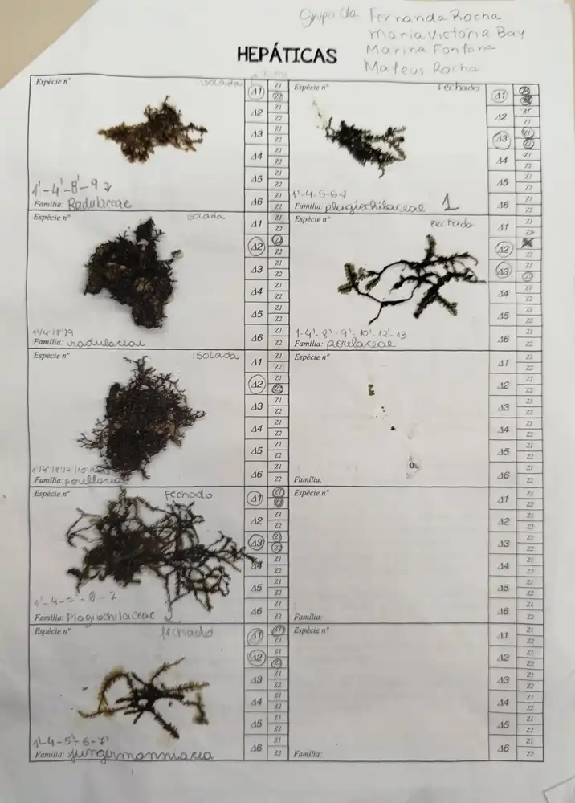
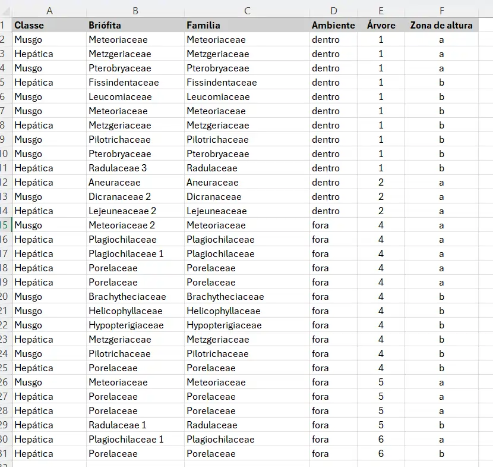

### Identificação Final da Coletas de Briófitas

Para podermos analisar os dados é necessário primeiro que todas as plantas estejam coladas na tabela, identificadas.

Além de identificadas, tem que esta indicar também ***todas as parcelas (envelopes)*** em que a espécie foi registrada, como no exemplo

{fig-align="center" width="250"}

### Montando a Planilha

Copiem o seguinte arquivo para o computador de vocês

**Planilha para os cálculos**

[Briófitas](files/briofitas.xlsx){target="_blank" rel="noopener noreferrer"}

Digitem os dados coletados em campo com a seguinte Estrutura:

::: callout
Coluna A: Classe \> Hepática ou Musgo

Coluna B: Briófita \> Morfoespécie de briófia

Coluna C: Família \> Família da Briófita

Coluna D: Ambiente \> Qual dos dois Ambientes

Coluna E: Árvore \> número da árvore

Coluna F: Zona de Altura \> alta ou baixa
:::

Para Ficar assim:

{fig-align="center" width="500"}

Tragam isso pronto para a aula de análise dos dados
