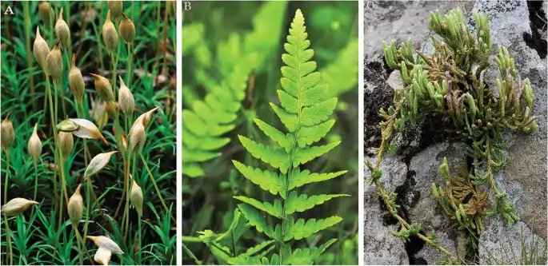

## Biodiversidade de Briófitas e Pteridófitas

É uma disciplina teórico-prática do 3º período do Curso de Ciências Biológicas. Nela os estudantes integram conhecimentos referentes à estrutura de comunidades e ecossistemas, analisando o ramos evolutivo das plantas terrestres, com ênfase em briófitas e pteridófitas. Ao final, são capazes de reconhecer os táxons envolvidos, suas relações evolutivas, interações ambientais e importância econômico-social.

{fig-align="center" width="400"}

{fig-align="center" width="800"}

### Atividades - Trabalhos

Ao longo do sementre vocês vão realizar dois projetos de pesquisa nos moldes de atividades desenvolvidas profissionalmente por biólogos em campo. Uma sobre ***ecologia de briófitas*** que envolve a produção de um pequeno artigo cietífico (nota científica) e outro sobre ***inventário florístico*** de pteridófitas, que envolve a produção de uma coleção com os indivíduos indentificados até gênero.

[**1 - Nota Científica Sobre Ecologia de Briófias**](cripto2.qmd)

[**2 - Inventário florístico de Pteridófitas**](cripto1.qmd)
