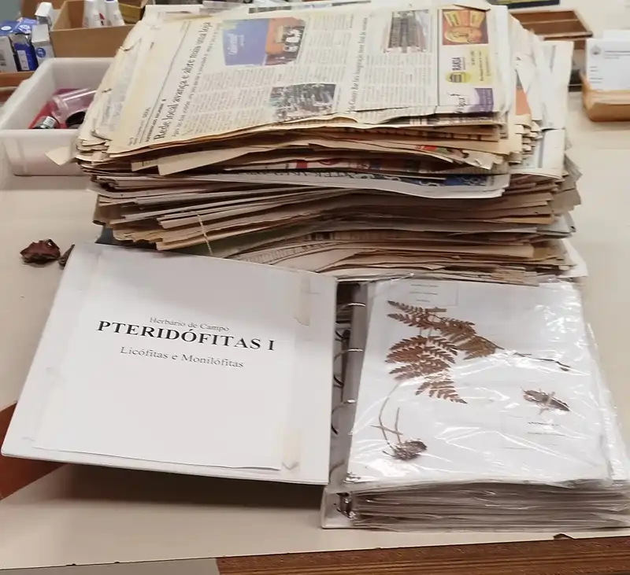
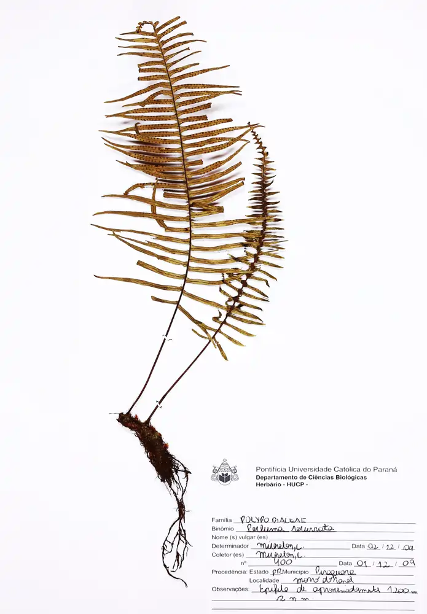
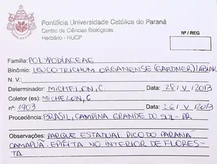
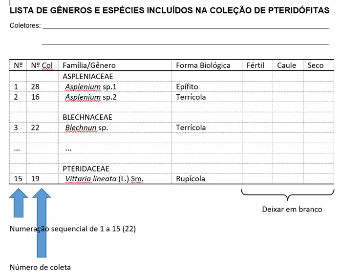
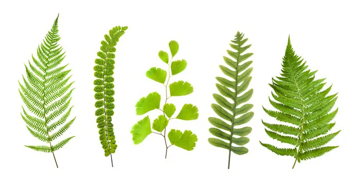

## Inventário florístico de Pteridófitas

***Inventários florísticos*** são estudos técnicos essenciais para a conservação da flora, com o objetivo de identificar, caracterizar e avaliar o estado de conservação das espécies vegetais em uma área. Eles fornecem dados detalhados sobre a riqueza de espécies, distribuição e status de ameaça de espécies, sendo fundamentais para a elaboração de planos de manejo, políticas de conservação e estudos de impacto ambiental.

Nestes levantamentos são identificadas Identificam espécies ameaçadas, endêmicas, medicinais ou exóticas invasoras. Eles Apoiam a delimitação de áreas prioritárias para proteção, como Unidades de Conservação, subsidiam a restauração ecológica e o manejo sustentável de ecossistemas, especialmente em áreas degradada, além de contribuem para a criação de bancos de dados e herbários, preservando o conhecimento científico.

{fig-align="center" width="350"}

------------------------------------------------------------------------

***Trabalho em DUPLAS*** (15 plantas - 6 famílias) ou ***TRIOS*** (21 plantas - 8 famílias)

***ATENÇÃO: NÃO COLETAR NA PUC, SE TODO MUNDO FIZER ISSO TODO ANO ACABAM-SE AS PTERI DO CAMPUS.***

***MUITA PRESSÃO DE COLETA***

Para o RA de Pteridófitas vocês vão coletar plantas em locais por vocês escolhidos (podem ser localidades diversas)

***As plantas deverão estar:***

-   secas e acondicionadas de acordo com os procedimentos de herborização usuais para os grupos [(Fidalgo & Bononi 1989)](https://archive.org/details/1989-fidalgo-bononi-tecnicas-coleta-preservacao-e-herborizacao-material-botanico){target="_blank" rel="noopener noreferrer"}

-   Montadas em folhas sufite A4 em uma coleção científica

-   Organizadas por ordem alfabética crescente de táxon.

-   Determinadas até gênero

Exemplo de coleta

{fig-align="center" width="278"}

Ficha de coleta corretamente preenchida

{fig-align="center" width="200"}

**Plantas úmidas serão descartadas não valendo como coletas**

-   Todas as exsicatas devem estar com as fichas de tombo devidamente preenchidas, inclusive com o número de coleta.

-   Todas as coletas devem estar secas, férteis, com parte do caule e identificadas até gênero, qualquer erro invalida a coleta.

-   A coleção deve incluir: Em dupla: 15 espécies de pelo menos 6 famílias diferentes Em trios: 21 espécies de pelo menos 8 famílias diferentes 

-   A entrega deve ainda incluir: Uma TABELA com as os gêneros e famílias coletados (ver o modelo)

Modelo de Tabela: As colunas “Fértil”, “Caule” e “Seco” servem para conferência pelo professor. A desorganização também desconta ponto

{width="400"}

[**CHAVE COMPLETA**](files\completa.pdf){target="_blank" rel="noopener noreferrer"}

[**CHAVE SIMPLIFICADA**](files\simplificada,pdf){target="_blank" rel="noopener noreferrer"}

Chave on-line:

[http://www.plantsystematics.org/cgi-bin/dol/dol_diagkey.pl?matrix=fernfamily4.winc&new=1 ](http://www.plantsystematics.org/cgi-bin/dol/dol_diagkey.pl?matrix=fernfamily4.winc&new=1){target="_blank" rel="noopener noreferrer"}

{fig-align="center" width="300"}
