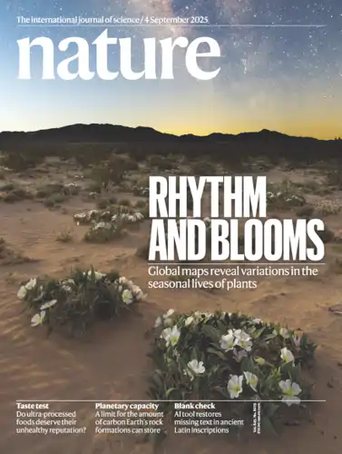
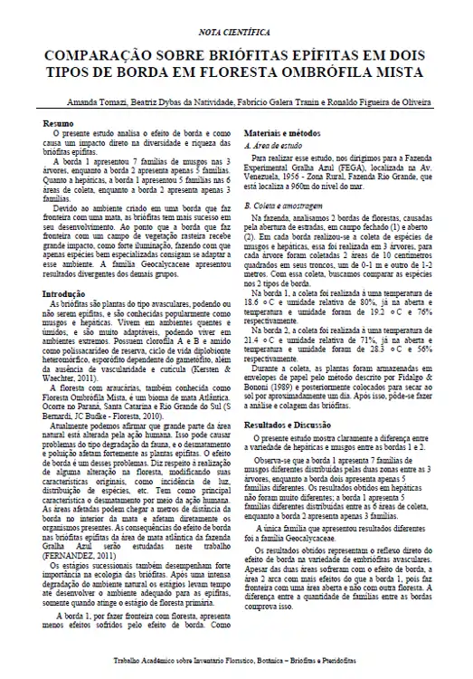

## Nota Científica Sobre Ecologia de Briófias

**Artigos científicos** são publicações que apresentam os resultados originais de pesquisas realizadas, com o objetivo de compartilhar novos conhecimentos com a comunidade acadêmica. Eles seguem um padrão estruturado, com seções como introdução, metodologia, resultados, discussão e conclusão, garantindo clareza, objetividade e rigor científico.

Esses artigos são fundamentais para o avanço do conhecimento biológico, permitindo a validação de hipóteses, a divulgação de descobertas (como novas espécies, mecanismos celulares ou impactos ambientais) e a promoção do debate científico. São publicados em revistas especializadas e passam por um processo de **revisão por pares** para garantir qualidade e credibilidade.

A biologia, por ser uma ciência baseada no **método científico**, depende fortemente dos artigos para documentar e disseminar descobertas, desde processos celulares até interações ecológicas e evolutivas.

{fig-align="center" width="150"}

------------------------------------------------------------------------

**Trabalho em equipes de até 4 alunos**

Para este trabalho iremos coletar as briófitas na FEGA (será em um sábado pela manhã, data a combinar). Ao menos um integrante da equipe deve comparecer a esta atividade. Caso contrário não será possível sua execução.

Após a coleta as plantas serão identificadas em laboratório e os dados serão tabulados e analisados.

As plantas serão entregues junto com o trabalho escrito em formato a ser explicado em sala de aula

O trabalho sobre ecologia de briófitas consiste em uma nota científica (pequeno artigo com 3 a 4 páginas, em duas colunas) baseado nos resultados encontrados. A nota deve apresentar a seguinte estrutura: (ver modelos)

{width="424"}

***Introdução (200 a 300 palavras).***

A introdução situa o problema, nela devem ser abordados temas relacionados aos estudados, como

-   briófitas,

-   epífitas avasculares

-   floresta de araucária,

-   áreas alteradas,

-   estágios sucessionais etc.

    A última frase da introdução deve apresentar os objetivos: (ex: "Este estudo busca identificar as briófitas encontradas em uma área de Floresta Ombrófila Mista da Fazenda Experimental Gralha Azul e analisar sua diversidade e distribuição, correlacionando esses aspectos às condições ambientais e possíveis interações ecológicas.")

***Materiais e métodos (200 a 300 palavras)***:

-   Área de estudo: Localização e características ambientais.

-   Procedimentos de coleta: Critérios de seleção das amostras, método de coleta e registro de dados.

-   Preparação e identificação das espécies: Técnicas de análise e identificação das briófitas.

-   Critérios de análise dos dados: Métricas utilizadas para avaliar a diversidade e composição da comunidade (Índice de diversidade de Shannon)

***Resultados e Discussão (300-500 palavras)***

Apresentar os dados obtidos, incluindo a lista de táxons identificados e a análise da diversidade e distribuição das espécies.

Os principais aspectos a serem abordados incluem: 

-   Diversidade e estrutura da comunidade no geral: 

    -   Números totais de: Indivíduos, Espécies, Famílias, Musgos e hepáticas

    -   Média geral de briófitas e de espécies por árvore 

    -   Descrição das possíveis interações de musgos e hepáticas com outras espécies, incluindo:  Competição com outras epífitas ou organismos do solo.  Facilitação para o estabelecimento de plântulas de outras espécies vegetais.  Interações com microfauna, como invertebrados que utilizam as briófitas como habitat.  Papel na retenção de umidade e influência na microclimática local. 

-   Comparação entre microambientes (ex.: casca lisa ou aspera): Números totais em cada situação:  Indivíduos  Espécies  Famílias  Musgos e hepáticas  Média de indivíduos e espécies por árvore em cada situação

-   Índice de diversidade e interpretação dos resultados

-   Variações nas interações ecológicas entre os microambientes, avaliando se fatores como disponibilidade de luz, umidade e competição afetam a distribuição e abundância das briófitas.

-   Redes de interação e estabilidade da comunidade:

-   Como fatores ambientais influenciam a distribuição das espécies.

-   Possíveis interações entre briófitas e outros organismos.

-   Efeitos de perturbações naturais e antrópicas na estabilidade da comunidade 

-   Interpretação dos padrões observados com base na literatura científica.

***Referências Bibliográficas***

### Além do texto escrito, devem ser entregues as plantas coletadas e identificadas conforme orientação passada em aulas práticas

***Entregas:***

-   Nota científica impressa Plantas coletadas e identificadas, coladas nas tabelas de musgos e hepáticas

O texto deve seguir o modelo fornecido

[**Modelo de Nota científica**](files\modelo.docx){target="_blank" rel="noopener noreferrer"}

{width="209"}
