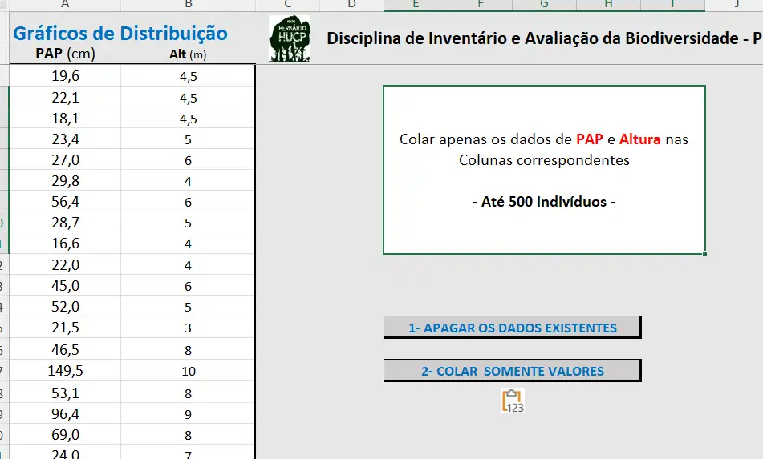
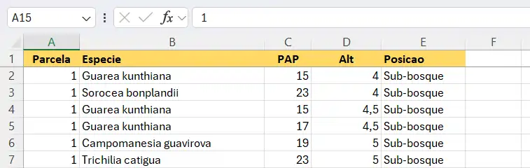

### 1 - Análise dos Parâmetros de Estágios Sucessionais

Utilizando a seguinte Planilha do Excel **Planilha para gráfico da distribuição de DAP, PAP e Altura**

[DAP](files\dap.xlsx){target="_blank" rel="noopener noreferrer"}

Digitem os dados de PAP (perímetro - em cm) e Altura (em m) nas colunas em branco

{width="500"}

------------------------------------------------------------------------

### 2 - Analise dos Dados coletados na fitossociologia

Digitem os dados coletados em campo em uma planilha do Excel com a seguinte Estrutura:

::: callout
Coluna A: Parcela

Coluna B: Especie =\> (Sem acento)

Coluna C: PAP =\> (em cm)

Coluna D: Alt =\> (altura, em metros)

Coluna E: Posicao =\> sem acento nem sinal cedilha
:::

Como neste Exemplo

{width="500"}

COPIEM OS SEGUINTES ARQUIVOS E INCLUAM SEUS DADOS NELES

**Planilha para os cálculos Volume por parcela e por espécie**

[Suficiência](files/vol.xlsx){target="_blank" rel="noopener noreferrer"}

**Planilha para os cálculos de Suficiência amostral por Volume**

[Volume](files/sufi.xlsx){target="_blank" rel="noopener noreferrer"}
