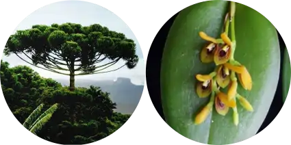

## Angiospermas e Gimnospermas

É uma disciplina teórico-prática do 4º período do curso de Bacharelado em Ciências Biológicas. Nela, os estudantes integram conhecimentos referentes a características físicas, biológicas e ecológicas dos ecossistemas aquáticos e terrestres, analisando os ramos evolutivos de plantas com sementes. Ao final, são capazes de reconhecer os táxons envolvidos, suas relações evolutivas bem como suas interações ambientais.

{fig-align="center" width="400"}

{fig-align="center" width="600"}

### Atividades - Trabalhos

Ao longo do sementre vocês vão realizar duas atividades relacionadas aos conteúdos da disciplina. Uma ***manual fotográfico*** da arborização urbana de Curitiba, no qual vocês vão produzir uma guia ilustrado dendrológico em PDF e e o ***expositor didático***, no qual vocês vão, com materiais do herbário, do museu de zoologia e produtos autorias, montar uma exposição temporária.

[1 - Guida de espécies da Arborização urbana de Curitiba](fanero1.qmd)

[2 - Exposição didática zoo-botânica](fanero2.qmd)
