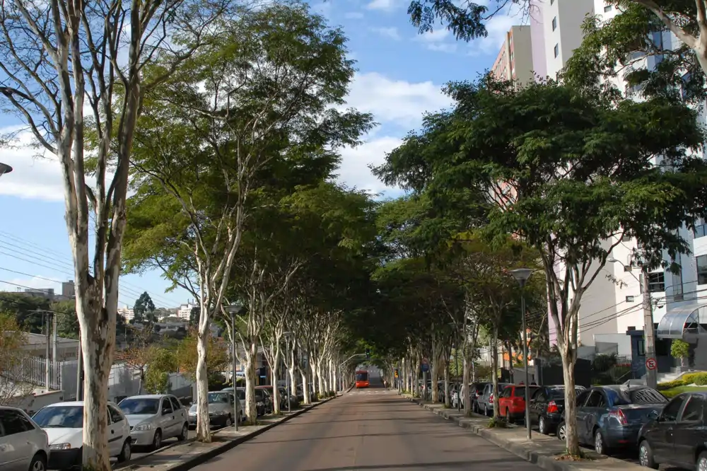
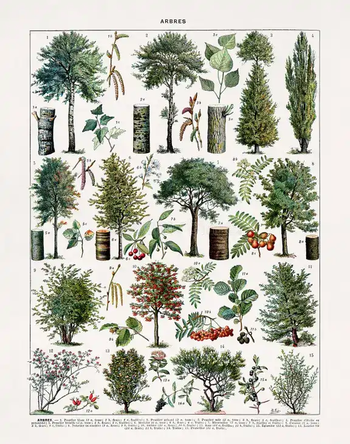
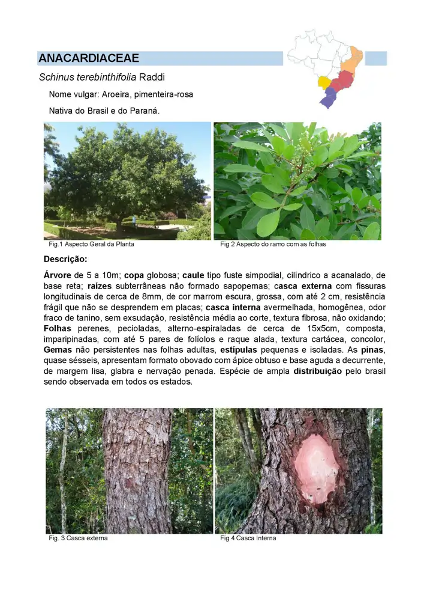
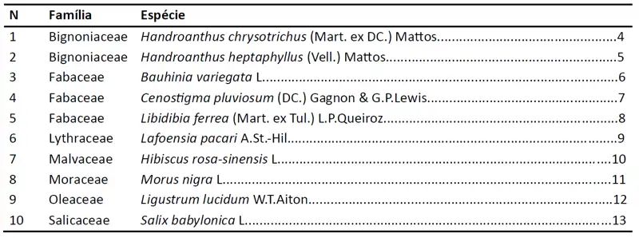
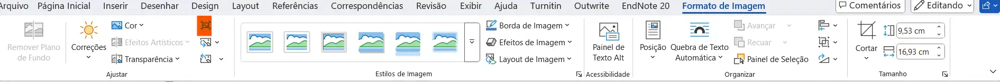

### 1 - Guia dendrológico de espécies da arborização de Curitiba

{fig-align="center" width="350"}

***Dendrologia*** é o ramo da botânica que estuda as plantas lenhosas, principalmente árvores e arbustos, e a sua morfologia externa. Centra-se sobretudo na identificação de espécies baseada nos caracteres vegetativos (como arquitetura da copa, tipo de casca e padrões foliares) e fitogeográficos. É extremamente útil em levantamentos de campo em que não se tem todas as espécies com flor ou mesmo para auxiliar na identificação preliminar de indivíduos férteis.

{fig-align="center" width="250"}

Leiam mais em  
<https://pt.wikipedia.org/wiki/Dendrologia>{target="_blank" rel="noopener noreferrer"}

***Objetivo***

Montar um guia fotográfico para identificação de espécies da arborização urbana de Curitiba

Como este:

[**Árvores da Cidade**](https://loja.uiclap.com/titulo/ua33942/?srsltid=AfmBOorBkZ6sLv7-SHWaPR4uTOQ3MfrP6iaRzj1t9dSn9tjOjDrKHTrG){target="_blank" rel="noopener noreferrer"}

Ou este:

[**New York City Trees**](https://www.amazon.com.br/New-York-City-Trees-Metropolitan/dp/0231128355){target="_blank" rel="noopener noreferrer"}

{fig-align="center" width="600" height="20"}

***Procedimentos***

::: {.callout}

1. Escolher 10 espécies da arborização urbana de Curitiba (árvores plantadas pela prefeitura nas ruas e praças)
2. Não considerar espécies plantadas dentro do jardim/quintal, nem de florestas nativas, nem espécies arbustivas ou ornamentais
3. Identificar as árvores com a [Chave dendrológica para Arborização Urbana de Curitiba](files/chave_urb.pdf){target="_blank" rel="noopener noreferrer"}
4. Completar, para cada espécie, a [Ficha dendrológica](files/descricao.pdf){target="_blank" rel="noopener noreferrer"}
5. Fotografar as principais características das espécies
6. Montar uma prancha para cada espécie, como no exemplo abaixo

{fig-align="center" width="400"}

:::

------------------------------------------------------------------------

***O trabalho final deve conter os seguintes itens:***

::: {.callout}

- Capa
- Uma página de introdução abordando a arborização urbana e sua importância para o ambiente das cidades e outros temas relevantes
- Um índice com as espécies em ordem alfabética de família e de espécie (semelhante ao exemplo abaixo; a formatação pode ser adaptada)

{width="400"}

- Uma prancha (A4) para cada espécie, incluindo:
  - Família
  - Espécie (com autor)
  - Nome vulgar
  - Nativa do Brasil ou exótica
  - Nativa do Paraná ou exótica
  - Distribuição no Brasil (consultar a Flora do Brasil)
  - Um parágrafo de texto contínuo com a descrição dendrológica da planta contendo todos os itens da ficha

:::

***O que incluir na descrição dendrológica***

::: {.callout}

TODAS AS CARACTERÍSTICAS ANOTADAS NA FICHA, INCLUINDO:

1) Características gerais (forma de crescimento, porte, copa)  
2) Caule/raiz (tipo, forma, secção, base, raízes)  
3) Casca  
   - externa (aspecto, desprendimento, cor, elementos)  
   - interna (resistência, aparência, oxidação, exsudação, odor, textura)  
4) Folha (tipo, tamanho, consistência, cor, divisão, filotaxia, forma, ápice, base, margem, nervação, pecíolo, decidualidade, odor)  
5) Outros (gemas, estípulas, indumento, etc.)

:::

6) Ao menos 4 fotografias: árvore, ramo com folha, casca externa, casca interna, características especiais (espinhos, acúleos, estípulas diferenciadas, etc.)

7) Uma das fotos deve incluir ao menos um membro da equipe

**ATENÇÃO:** não adianta copiar a descrição da Flora do Brasil; ela é diferente do que se pede neste trabalho.

***A Aroeira (espécie do exemplo) e as plantas descritas na aula prática não podem ser incluídas neste trabalho***

**Não** incluir dados sobre flor ou fruto.

***Antes de salvar, façam o seguinte:***

::: {.callout}

- No Word, selecione qualquer imagem
- Menu **Formato de Imagem** → **Compactar imagem**

{width="700"}

- Desmarque **Aplicar somente a esta imagem**

{fig-align="center" width="250"}

- Impressão: **220 ppi**
- Confirmar (**OK**)
- Salvar como **PDF**
- Postar o PDF

:::

***Podem adaptar e modificar a formatação como quiserem, desde que o conteúdo solicitado seja mantido***

### Bibliografia acessória para o trabalho

::: {.callout}

[Vibrans, A. C. (2010). Apostila de Dendrologia – FURB](https://pt.scribd.com/document/51252134/dendrologia){target="_blank" rel="noopener noreferrer"}

[Blum, C. T. (2023). Chave dendrológica simplificada para as principais famílias com árvores nativas no sul do Brasil](files/Blum2023.pdf){target="_blank" rel="noopener noreferrer"}

[Roderjan, C. V. (s.d.). Características vegetativas das principais famílias botânicas do sul do Brasil](files/dendro_sul.pdf){target="_blank" rel="noopener noreferrer"}

[Blum, C. T. (2023). Características dendrológicas das principais famílias com representantes arbóreos nativos no sul do Brasil](files/ResumoBlum.pdf){target="_blank" rel="noopener noreferrer"}

[Roderjan, C. V. Terminologia dendrológica](files/Terminologia.pdf){target="_blank" rel="noopener noreferrer"}

[Fidalgo, O. & Bononi, V. L. R. (1989). Técnicas de coleta e preparação de material botânico](https://archive.org/details/1989-fidalgo-bononi-tecnicas-coleta-preservacao-e-herborizacao-material-botanico){target="_blank" rel="noopener noreferrer"}

[Martins-da-Silva, R. C. V. (2002). Identificação de espécimes botânicos. Série Documentos, v. 143](https://www.infoteca.cnptia.embrapa.br/bitstream/doc/405766/1/OrientalDoc143.PDF){target="_blank" rel="noopener noreferrer"}

:::
