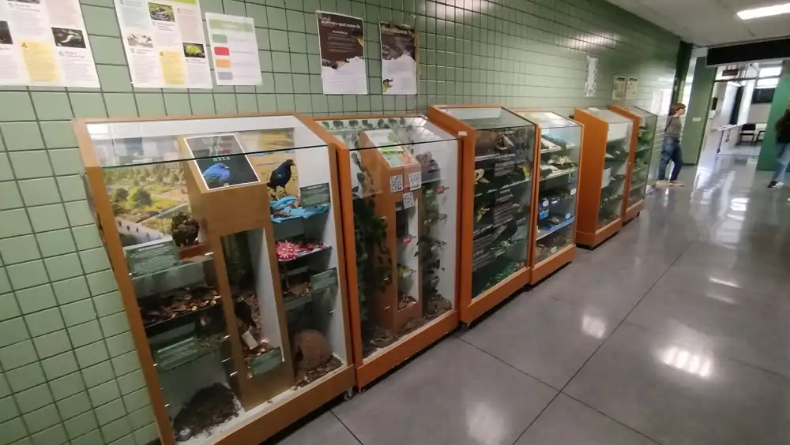

### 2 Exposição Didática

Atividade em equipes - Dividir a sala em até 8 grupos

***Objetivo:*** Preparar painéis para exposição didática a serem exibidos no corredor da Biodiversidade da PUC

{fig-align="center" width="500"}

***Temas:***

::: callout
-   Testudines
-   Leptosauria
-   Crocodilianos
-   Aves
-   Mamíferos
-   Gimnospermas
-   Angiospermas 1
-   Angiospermas 2
-   Outros temas (conversar com os professores)
:::

Utilizando-se de tanto materiais disponíveis nos museus de Zoologia e Herbário quanto outros materiais quaisquer, montar uma exibição sobre um dos temas apresentados. Para acompanhar o painel deve ser produzidos cartazes. O cartaz deve conter uma breve explicação sobre o tema em letras legíveis a 2m (Títulos em fonte 48p e texto em 26p) e pode conter ilustrações e imagens de fundo.

Cartazes em formato A4 ou A3 podem ser impresso pelos professores. Tamanhos maiores são responsabilidade dos alunos

Salvem o arquivo em PDF, coloquem o tema e o tamanho (A4 A3) ao final como nome do arquivo e enviem por aqui mesmo, na entrega do trabalho

***Critérios de Avaliação***

::: callout
As equipes e expositores serão avaliados pelos seguintes critérios:

1 - autonomia criativa

2 - autonomia na execução

3 - participação nas atividades de preparação

4 - qualidade das informações

5 - uso de materiais autorais

6 - qualidade dos textos

7 - inovação

8 - apresenta geral do painel

9 - uso adequado das peças dos museus

10 - utilização adequada e atualizada da nomina e da nomenclatura
:::
