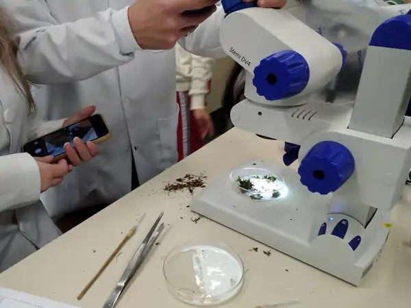
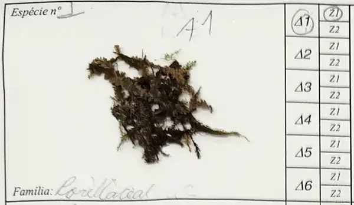
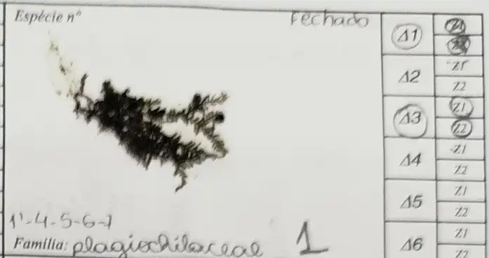
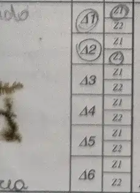
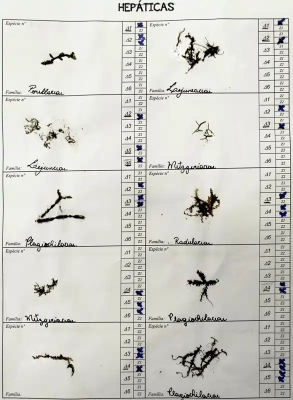

## Procedimentos para identificação de Briófitas em Laboratório

Após a coleta dos dados em campo, a próxima etapa de um trabalho de botânica é a identificação das espécies coletadas. De nada adianta coletar se o nome atribuido não estiver correto. Tudo que se sabe sobre uma espécie está correlacionado com o NOME e não com a espécie em si. Qualquer informação válida tem que estar atribuida a um nome correto, caso contrário a conclusão não será informativa.

**Para a Identificação das Briófitas vocês vão utilizar os seguintes arquivos**

[Chaves Briofitas Epífitas](files\ChaveBriofitas.pdf){target="_blank" rel="noopener noreferrer"}

[Guia_briofitas](https://mega.nz/file/MhNCEAwS#JWo43gDGEB8xOz-IPbH953ePKGiMZ8FYQqR5-VjXt00){target="_blank" rel="noopener noreferrer"}

Ambos estarão disponíveis no Laboratório para consulta.

{fig-align="center" width="400"}

------------------------------------------------------------------------

**Para a Identificação vocês farão o seguinte processo**

1)  Comecem pelo **envelope 1** e sigam a numeração, árvore por árvore (vai ficar mais fácil)

2)  Abram o envelope 1 sob a lupa,

    -   separem quantas espécies ocorrem,

    -   colem UMA na tabela de identificação (como fizeram na primeira aula)

    -   indiquem no quadrinhos ao lado em que árvore (Δ) e que altura (Z) foi observada

Assim:

{width="400"}

3)  Identifiquem cada espécie antes de colar a próxima

4)  Façam isso para todas deste envelope antes de passar para o próximo

5)  **ENVELOPE 2**: ao abrir o envelope 2

    -    comece procurando as espécies que já foram identificadas anteriormente e estão coladas na folha

    -   Se encontraram alguma repetida apenas ANOTEM SUA OCORRÊNCIA (Δ e Z).

6)  Cada espécie registrada devem ter anotado todos os estratos (Δ e Z) em que ocorre

Esta aqui a baixo, foi registradas nas Árvores 1 e 3 nos dois estratos de altura (Δ1 Z1 - Δ1 Z2- Δ3 Z1 - Δ3 Z2)

{width="250"}

Enquanto esta foi registrada nas árvores 1 - zona baixa e 2 - zona alta. (Δ1 Z1 - Δ2 Z2)

{width="146"}

7)  A tabela final dever ficar assim:

{width="400"}

8)  Após terminar a identificação vocês vão passar estes dados para a tabela do Excel

[Planilha para tabulação dos Dados](files\dados.xlsx){target="_blank" rel="noopener noreferrer"}
