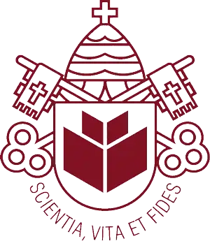
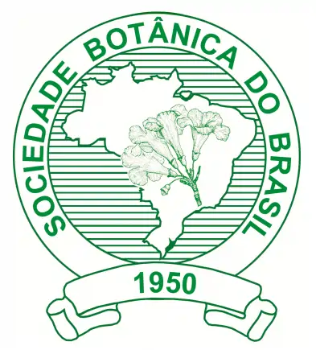
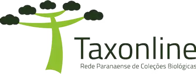
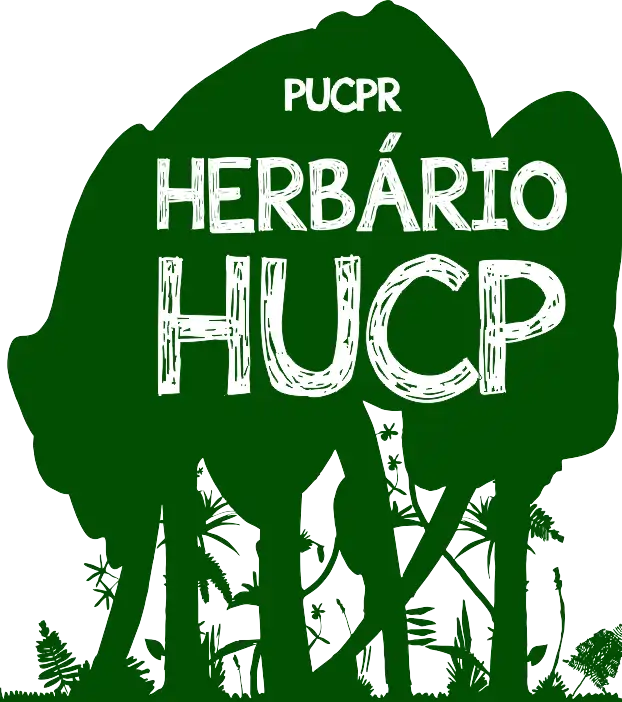
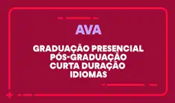

::: {#hero-heading}
Biólogo, Professor de Botânica e Ecologia Vegetal

{fig-align="left" width="26"} [PUCPR](https://www.pucpr.br/){target="_blank" rel="noopener noreferrer"} • {fig-align="left" width="26" height="30"} [Sociedade Botânica do Brasil](https://www.botanica.org.br/){target="_blank" rel="noopener noreferrer"} • [{width="79"}](https://www.taxonline.bio.br/){target="_blank" rel="noopener noreferrer"}

## Formação

Bacharel e Liceciado em Ciências Biológicas

Ms. Botânica - Ecologia Vegetal

Dr. Conservação da Natureza (Engenharia Florestal)

## Experiência

Professor \| Botânica \| 2002 - presente

Curador do [Herbário HUCP](https://www.pucpr.br/escola-de-medicina-e-ciencias-da-vida/herbario/){target="_blank" rel="noopener noreferrer"} \| 2018 - Presente {width="40"}

Consulturia Ambiental \| EIA-RIMA, Restauração, RAS, Inventário, Pareceres Técnicos \| 1998 - presente

Coordenador \| Comissão de Ecologia Vegetal da Sociedade Brasileira de Botânica \| 2018 - 2022

## Disciplinas Ministradas no Curso de Biologia

-   Morfologia Vegetal

-   Biodiversidade de Algas e Fungos

-   Biodiversidade de Briófitas e Pteridófitas

-   Biodiversidade de Fanerógamas

-   Inventário e avaliação da biodiversidade - Flora

-   Ecologia da Restauração

## Atividade e Arquivos das aulas

Enquanto estão cursando, vocês também podem acessar as atividades e o conteúdo direto pelo [Ambiente Virtual de Aprendizagem](https://www.pucpr.br/ava){target="_blank" rel="noopener noreferrer"}

{width="120"}
:::

------------------------------------------------------------------------

::: {style="text-align: center; margin-top: 3em; padding-top: 1em; border-top: 1px solid #dee2e6;"}

Site desenvolvido com Quarto • RStudio

Prof. Rodrigo Kersten • PUCPR

:::
