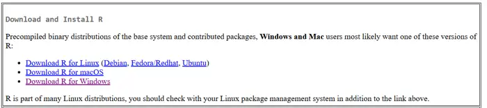
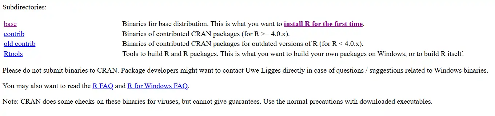

***Instalar o R***

<https://cran-r.c3sl.ufpr.br/>{target="\_blank" rel="noopener noreferrer"}

{fig-align="center" width="500"}

{fig-align="center" width="600"}

**ANTES DE MAIS NADA**

1\) Criem uma pasta chamada "Inventario" direto na raiz do drive "C:" --\> (**SEM ACENTO**)

2\) Copiem o arquivo do excel (dos dados) para esta pasta

3) Simplifiquem o nome do arquivo do excel (Ex: de "FOM_Ctba 10x10 Cid. Industrial.xlsx" para "Ctba.xlsx" ou "Inventario.xlsx")

4\) Vejam qual o tamanho das parcelas utilizadas no seu levantamento
