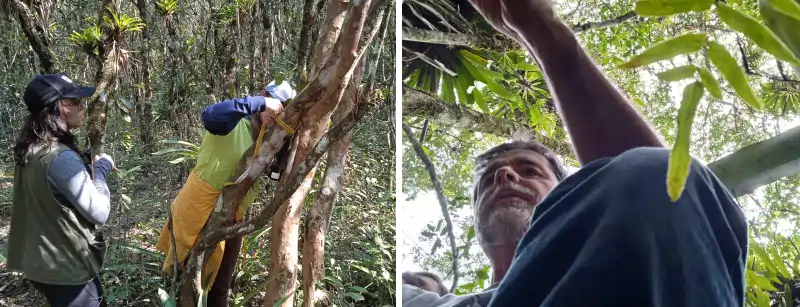

## Inventário e Avaliação da Biodiversidade

Na disciplina os estudantes aprendem a planejar e executar inventários e avaliações de biodiversidade para os principais grupos botânicos. Conhecem a biodiversidade dos grupos e os métodos de amostragem, análise, apresentação dos dados e entrega de relatórios oficiais. Os estudantes vivenciam atividades de campo com demonstrações práticas.

### Inventário Florestal

***Inventário e avaliação da biodiversidade*** são processos essenciais para compreender, monitorar e proteger a diversidade de espécies e ecossistemas. O ***inventário*** envolve a identificação e caracterização de espécies em uma área, podendo focar em flora (como em inventários florestais) ou fauna (como levantamentos faunísticos). São fundamentais para o licenciamento ambiental, planejamento de manejo, conservação e educação ambiental A ***avaliação da biodiversidade*** vai além da identificação, envolvendo a análise da riqueza, equabilidade e distribuição das espécies, além da avaliação do estado de conservação e das interações ecológicas sendo fundamental nas pesquisas sobre ecologia e conservação da natureza.

Para saber mais sobre inventários, acessem a seguinte página:

[Inventários Florestais para supressão de Vegetação](https://matanativa.com.br/inventario-florestal-para-supressao-de-vegetacao/){target="_blank" rel="noopener noreferrer"}

{fig-align="center" width="600"}

{fig-align="center" width="600"}

### Relatório Final da Disciplina

Como avaliação da disciplina vocês farão uma atividade simulada de um "PEDIDO DE AUTORIZAÇÃO DE SUPRESSÃO DA VEGETAÇÃO" BASEADOS na Instrução Normativa do IAT. Para isso, vocês vão passar por todos os passos de um inventário sobre ecologia vegetal, desde a coleta de dados até a análise e redação final do relatório. Estes procedimentos são utilizados tanto em consultoria ambiental como em qualquer estudo sobre ecologia de comunidades vegetais ou sobre biodiversidade.

[***Relatório Final da Disciplina***](relinvent.qmd)
