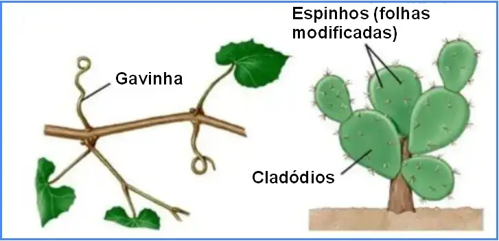

## Morfologia Vegetal para Biologia - PUCPR

Morfologia Vegetal é uma disciplina teórico-prática do 1º período dos Cursos de Ciências Biológicas. Nela os estudantes integram conhecimentos referentes à estrutura e funcionamento básico das células, tecidos e órgãos vegetais relacionando-os ao ambiente e aos aspectos evolutivos das plantas. Ao final, são capazes de reconhecer as células e tecidos, sua função e importâncias ecológica.

{fig-align="center" width="400"}

{fig-align="center" width="800"}

### Atividades - Trabalhos

Ao longo do sementre vocês vão realizar dois trabalhos relacionados ao conteúdo trabalhado em sala. O primeiro corresponde a um ***Modelo de Célula*** vegetal e o outro sobre ***Dendrocronologia***

[**1 - Modelo de Célula Vegetal**](morfo1.qmd)

[**2 - Dendrocronologia**](morfo2.qmd)
