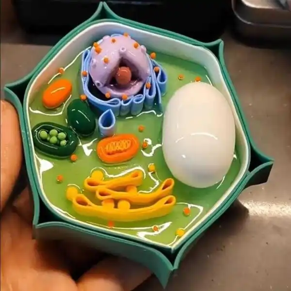
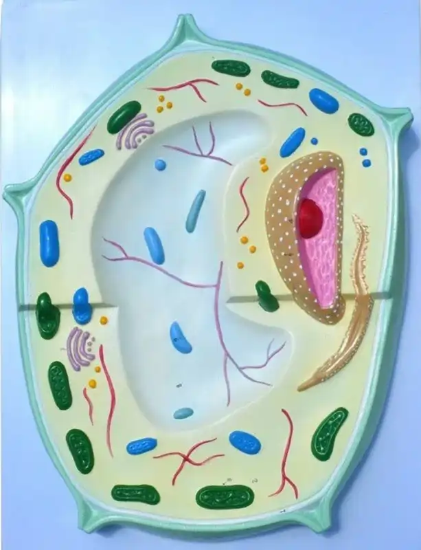

### 1 Modelo de Célula Vegetal

{fig-align="center" width="300"}

o trabalho consiste na confecção modelo de uma célula vegetal em material a escolha do aluno.

A célula deve conter, no mínimo, as seguintes estruturas, em escalas próximas ao real (***não*** é necessário representar o citoplasma)

::: callout
-   Parede celular
-   plasmodesmos
-   membrana plasmática
-   núcleo
-   cloroplastos
-   tilacóides
-   amiloplastos
-   vacúolo
-   mitocôndrias
-   retículos endoplasmáticos liso
-   retículos endoplasmáticos rugoso
-   ribossomos
-   microcorpos
-   golgi
-   citoesqueleto
:::

**modelos confeccionados em materiais reciclados/alternativo/não poluentes recebem 0,5 pto extra**

{fig-align="center" width="100"}
