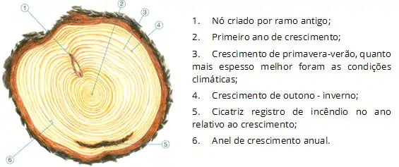
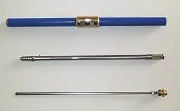
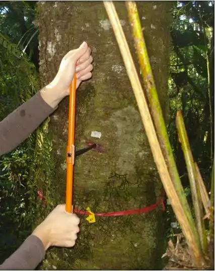
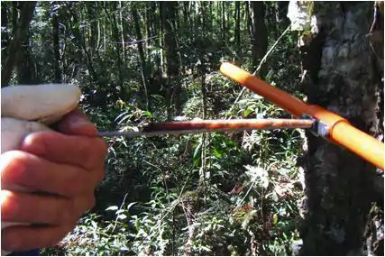
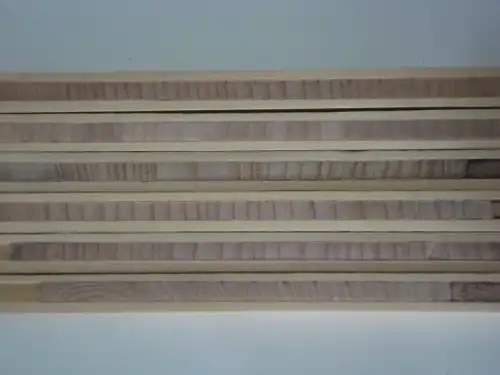
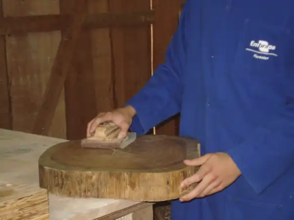
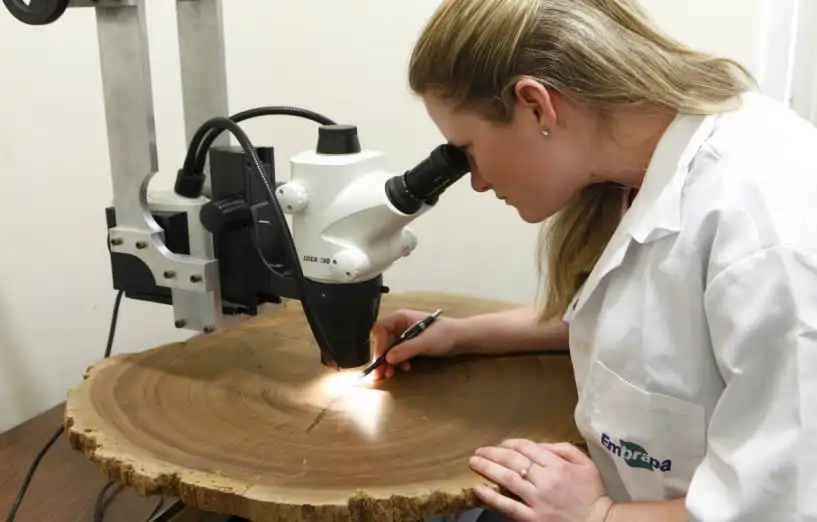
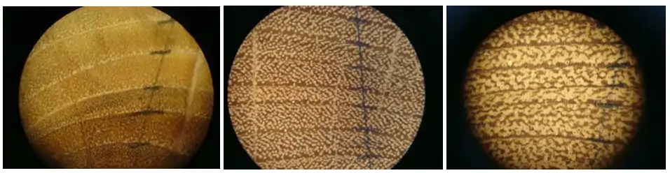
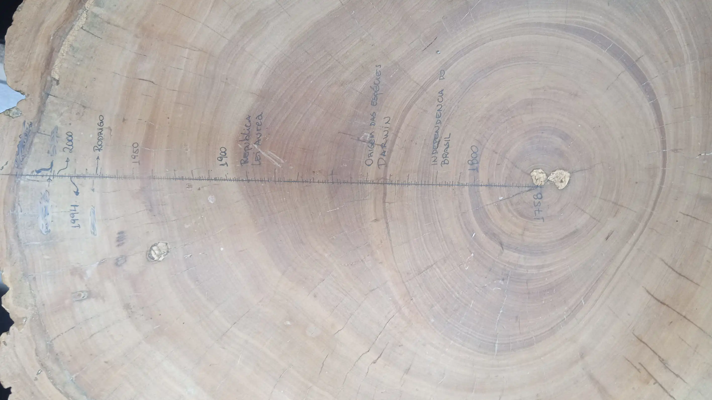

### 2 Dedrocronologia

Dendrocronologia é a ciência que usa os anéis de crescimento para analisar padrões ecológicos, como influencia do ambiente (solo, hidrologia, geologia, etc), estudar o clima presente e reconstruir o clima e o ambiente do passado.

{fig-align="center" width="300"}

Leiam o seguinte texto

[Dendrocronologia: a historia que as árvores contam](https://matanativa.com.br/dendrocronologia-a-historia-que-as-arvores-contam/)

Na dedrocronologia é comum o uso de amostras não destrutivas. Em geral um pequeno tubo retirado do meio do tronco basta. Isso é feito com um instrumento especial, o trado de incremento (Sonda Pressler).

{fig-align="center" width="350"}

Este ai de cima é um trado desmontado

Este aqui de baixo é um trado em ação

{fig-align="center" width="200"}

Com ele é possível se retirar uma pequena amostra do caule para a contagem dos aneis

{fig-align="center" width="350"}

{fig-align="center" width="350"}

Veja como se faz:

[Trado de Incremento](https://youtu.be/Dj09nnzYgpE)

Se tiver curiosidade veja também este link:

[Trado de Incremento florestal](https://youtu.be/AsbKcTOcZ7Q)

{fig-align="center" width="800"}

### Para o trabalho, vocês vão utilizar uma bolacha (disco) de um tronco de árvore

***Preparar a Madeira***

::: callout
O primeiro passo é lixar o disco

{fig-align="center" width="350"}

Começando com lixas mais grosas (80), ou 60 se a madeira está muito irregular.

Aos poucos passa-se para lixas mais finas (150 - 220) podendo chegar até em 600 em madeiras mais duras.

A sequência de lixas 80 - 150 - 220 resolve em praticamente todos os casos\
:::

***Contar os Anéis***

::: callout
Quando a madeira estiver pronta, trace com um lápis, pelo menos duas linhas que saiam da medula e sigam perpendiculares até a casca. Nessa linha serão contados os anéis. Ao final, se quiserem podem passar a caneta. Isso funciona bem se utilizarem uma de ponta muito fina (0,1 ou 0,3) tipo nanquim.

Escreva também seu nome e o ano em uma parte que não atrapalhe a contagem.

Este material ficará em exposição no Lab

Os anéis podem ser contados com uma lupa (desde de que caiba o disco)

{fig-align="center" width="350"}

{fig-align="center" width="600"}

Mas vocês podem contar em casa utilizando a câmera do celular apoiado em um suporte qualquer

Se você sabe o ano em que árvore foi coletada, pode traçar a história pretérita da árvore
:::

Esta aqui é a minha mesa de churrasco, eu cheguei até a lixa 600 e contei os anéis em casa com meu celular.

{fig-align="center" width="500"}

Esta peroba foi cortada durante a construção da represa de Mauá da Serra em Jaguariaiva em 2012 e nasceu, possivelmente um pouquinho antes de 1758 (foi possível contar até ai), junto com o Mozart.

**O QUE DEVE SER ENTREGUE**

::: callout
O Disco propriamente lixado com:

1.  aneis de crescimento marcados

2.  final do cerne (se está diferenciado)

3.  marcas de fogo ou outras lesões

4.  marcas de ramificações ou galhos

5.  marcas de insetos ou outras pragas

6.  Um documento (PDF) com informações sobre o disco
:::

***Documento PDF***

::: callout
1.  Nomes da dupla

2.  Nome da espécie analisada

3.  Região, Estado e municípo da coleta

4.  Três fotos (ao menos)

-   Disco antes de ser lixado

-   Disco finalizado com as marcações

-   Detalhe do disco mostrando lenho inicial e tardio, vasos e fibras/traqueídeos

Informações sobre o disco

-   Qual o diâmetro da bolacha (disco)?

-   Quantos anéis foram registrados em cada linha? Houve diferença entre as linhas? Explique.

-   Existem marcas/lesões na madeira?  O que você acha que é? (Fogo, batida, predação, inseto, etc.)

-   Há diferença entre cerne e alburno?

Responda:

-   Há diferença entre o crescimento nos anos iniciais e finais? Explique

-   Em algum(uns) ano(s) foram registrados crescimentos menores ou maiores que a média? Justifique
:::
