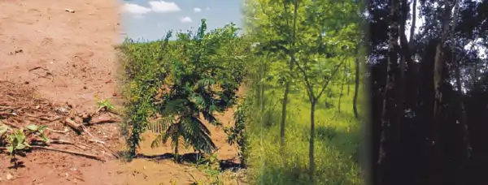

## Ecologia da Restauração

Biologia da Conservação e Restauração de Impactos Ambientais é uma disciplina teórica do 8º período dos cursos de Bacharelado e Licenciatura em Ciências Biológicas. Nela os estudantes integram conhecimentos ecológicos adquiridos ao longo do curso sob o enfoque aplicado da Biologia da Conservação e da Restauração, relacionando-os a atual crise de biodiversidade. Ao final, são capazes de avaliar, planejar e intervir em situações que demandem estratégias para a conservação e recuperação dos ecossistemas.

{fig-align="center" width="600"}

{fig-align="center" width="600"}

### Relatório Final da Disciplina

A ***ecologia da restauração*** é a base científica que orienta o processo de auxílio à recuperação de ecossistemas degradados ou destruídos, visando restaurar sua biodiversidade, estrutura e funções ecológicas. Diferente da simples recuperação, busca recriar ecossistemas autossustentáveis, utilizando espécies nativas e integrando comunidades locais.

Trabalho em equipes de 3-4 alunos

Cada equipe deverá preparar um plano de restauração ambiental de uma área de vegetação nativa do Paraná

O plano final deve estar de acordo com a legislação ambiental, formatado como um trabalho profissional de um biólogo e seguindo as diretrizes do IAT mais atuais

{fig-align="center" width="600"}

### Referências

[PRAD IAT portaria_170-2020_com](https://www.iat.pr.gov.br/sites/agua-terra/arquivos_restritos/files/documento/2020-09/portaria_170-2020_com_anexos.pdf){target="_blank" rel="noopener noreferrer"}

[Aspectos da legislação ambiental para a revegetação de matas ciliares no Paraná](https://e-revista.unioeste.br/index.php/actaiguazu/article/view/9160){target="_blank" rel="noopener noreferrer"}

[Modelo do relatório Final](files/prad.docx){target="_blank" rel="noopener noreferrer"}
